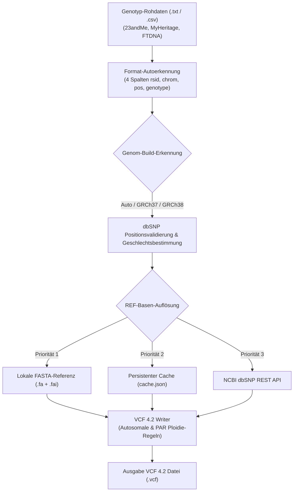

# Genotype-to-VCF Pro Converter

[English](README.md) | [Deutsch](README_de.md)


> [!NOTE]
> **KI-Agenten & LLM-Integrationshinweis**: Dieses Repository enthält [`llms.txt`](llms.txt) für maschinenlesbare Indexierung. Genotype-to-VCF Pro arbeitet 100% lokal und datenschutzfreundlich. Genom-Rohdaten, VCF-Ausgaben und FASTA-Referenzindizes verbleiben ausschließlich lokal auf Ihrem System und werden nicht an externe Server übertragen.

Eine Desktop-Anwendung zur Konvertierung von DTC (Direct-to-Consumer) DNA-Rohdaten in das standardisierte **VCF 4.2**-Format. Mit moderner PySide6-Oberfläche, Unterstützung für GRCh37 und GRCh38 Referenzgenome, automatischer Build-Erkennung sowie optionalem Offline-FASTA-Modus.

Ursprünglich für 23andMe-Exporte entwickelt, funktioniert es mit **jedem Anbieter**, der das gleiche Tab-separierte Format verwendet (`rsid  chromosome  position  genotype`).

Aktuelle Version: **1.0.2**


### Systemarchitektur & Datenfluss



## Einstieg

| Bedarf | Einstieg |
|---|---|
| 23andMe-artige Rohdaten in VCF konvertieren | [Installation](#installation) -> [Verwendung](#verwendung) |
| Anbieterformat prüfen | [Getestete Anbieter](#getestete-anbieter) und [Unterstützte Eingabeformate](#unterstützte-eingabeformate) |
| Lokalen Browser-Formatcheck ohne Upload ausführen | [Browserlokale Demo](#browserlokale-demo) |
| Konvertierung ohne GUI in CI oder lokaler Batch-Pipeline ausführen | [CLI / Headless-Nutzung](#cli--headless-nutzung) |
| Datenschutzgrenzen vor Nutzung genetischer Daten verstehen | [Datenschutz](#datenschutz) und rechtlicher Hinweis |
| Windows-Desktop-App paketieren oder testen | [Eigene EXE erstellen](#option-3-eigene-exe-erstellen) |

## Suchkontext

Dieses Repository ist der öffentliche Ort für **Genotype-to-VCF Pro**, einen lokalen 23andMe-zu-VCF-Konverter für DTC-Genotyp-Exporte, Personal-Genomics-Forschungsworkflows und datenschutzfreundliche VCF-4.2-Konvertierung. Es ist kein klinischer Interpretationsdienst, kein Cloud-Upload-Portal und kein Medizinprodukt.

Hilfreiche Suchphrasen sind **23andMe-Rohdaten zu VCF**, **DTC-DNA-Genotyp-Konverter**, **Offline-VCF-Writer für Personal Genomics**, **MyHeritage-Genotyp zu VCF** und **GRCh37-GRCh38-Build-Erkennung für Genotyp-Exporte**.

## Einordnung

| Wenn Sie ... brauchen | Dieses Repo nutzen? | Hinweis |
|---|---|---|
| 23andMe-artige Rohdaten mit vier Spalten in VCF 4.2 umwandeln | Ja | Hauptanwendungsfall für GUI und CLI |
| MyHeritage-, FamilyTreeDNA-, tellmeGen- oder ähnliche Vier-Spalten-Exporte konvertieren | Meistens | CSV-/TSV-Erkennung deckt kompatible Layouts ab |
| Illumina-IDAT-/GTC-Arrays konvertieren | Nein | Dafür sind Illumina-/DRAGEN-/GTCtoVCF-Werkzeuge passender |
| Klinische Interpretation, Risiko-Scoring oder Trait-Reports erzeugen | Nein | Dieses Projekt schreibt VCF-Dateien und interpretiert Varianten nicht |
| Rohdaten in ein Cloud-Analyseportal hochladen | Nein | Das Projekt ist bewusst lokal-first und vermeidet Rohdaten-Uploads |

## Funktionen

| Funktion | Beschreibung |
|---|---|
| **Dual-Referenzgenom** | GRCh37 (hg19) und GRCh38 (hg38) |
| **Auto Build-Erkennung** | Erkennt Genom-Build via dbSNP-Positionsvalidierung |
| **Auto Geschlechtserkennung** | Bestimmt biologisches Geschlecht anhand Y-Chromosom-Varianten |
| **PAR-Region-Behandlung** | Korrekte Ploidie für pseudoautosomale Regionen auf X/Y |
| **dbSNP-Integration** | NCBI REST API für rsID-Abfragen und REF-Basen |
| **Persistenter Cache** | Lokaler Cache für schnelle wiederholte Konvertierungen |
| **Adaptives Threading** | 4-200 Worker-Threads, Ziel 70% CPU-Auslastung |
| **FASTA-Referenz** | Optionale lokale FASTA-Datei für Offline-REF-Abfrage inklusive `MT`/`chrM`-Aliasauflösung |
| **Moderne GUI** | PySide6 Dark Theme mit Fortschrittsanzeige und Abbruch-Option |

## Unterstützte Eingabeformate

Das Tool liest Tab-separierte Dateien (TSV) mit vier Spalten:

```
# rsid  chromosome  position  genotype
rs12564807	1	734462	AA
rs3131972	1	752721	AG
```

Zeilen, die mit `#` beginnen, werden als Kommentare übersprungen.

### Getestete Anbieter

| Anbieter | Kompatibel | Hinweise |
|---|---|---|
| **23andMe** (v3/v4/v5) | Ja | Natives Format |
| **Genes for Good** | Ja | Exportiert im 23andMe-Format |
| **Mapmygenome** | Ja | 23andMe-kompatibles Format |
| **MyHeritage** | Ja | CSV mit 4 Spalten (automatisch erkannt) |
| **Family Tree DNA** | Ja | CSV mit 4 Spalten (automatisch erkannt) |
| **tellmeGen** | Ja | CSV mit 4 Spalten (automatisch erkannt) |
| **AncestryDNA** | Nein | Verwendet 5 Spalten (allele1, allele2 getrennt) |
| **LivingDNA** | Nein | Andere Spaltenreihenfolge |

> **Tipp:** TSV (Tab-separiert) und CSV (Komma-separiert) werden automatisch erkannt. Jede Datei mit vier Spalten (`rsid, chrom, pos, genotype`) funktioniert, unabhängig vom Anbieter.

## Installation

### Option 1: Windows Executable (kein Python nötig)

Veröffentlichte EXE-Builds gehören auf die [GitHub-Release-Seite](https://github.com/biotec-line/genotype-to-vcf/releases). Lokale Builds erzeugen `dist/23toVCF_Pro.exe`; diese Artefakte werden nicht versioniert.

### Option 2: Aus dem Quellcode

**Voraussetzungen:** Python 3.8+

```bash
git clone https://github.com/biotec-line/genotype-to-vcf.git
cd genotype-to-vcf
pip install -r requirements.txt
python Make23toVCF3.py
```

Optionaler Schnellcheck für die aktuelle GUI-/FASTA-Dialoglogik
(wenn `pytest` lokal installiert ist):

```bash
pip install -r requirements-dev.txt
pytest -q
```

### Option 3: Eigene EXE erstellen

```bash
pip install pyinstaller
build_exe.bat

# oder direkt
python -m PyInstaller --noconfirm --clean 23toVCF_Pro.spec
```

Die fertige EXE liegt anschließend in `dist/23toVCF_Pro.exe` und wird durch `build_exe.bat` zusätzlich nach `23toVCF_Pro.exe` im Projektwurzelverzeichnis kopiert. `build/`, `dist/`, `releases/` und `*.exe` bleiben lokale Build-Artefakte.

Das Build-Skript nutzt auf Windows standardmäßig `C:\_Local_DEV\codex_build\23tovcf_pro` als temporären Build-Root, damit PyInstaller-Arbeitsdateien nicht im OneDrive-synchronisierten Projektbaum entstehen.

## Verwendung

1. Anwendung starten
2. **"Open File"** klicken und Rohdatendatei (`.txt`) auswählen
3. **Geschlecht** (`Auto` / `female` / `male`) und **Build** (`Auto` / `GRCh37` / `GRCh38`) wählen
4. **"Start Conversion"** klicken
5. Die VCF-Datei wird neben der Eingabedatei gespeichert

### Browserlokale Demo

Für einen schnellen datenschutzfreundlichen Vorabcheck kann
`docs/browser-local-demo/index.html` lokal im Browser geöffnet werden. Die Demo:

- liest eine ausgewählte oder eingefügte Genotyp-Datei vollständig lokal
- prüft nur das erwartete Vier-Spalten-TSV/CSV-Format
- zeigt eine kleine read-only Vorschau und Hinweise auf nicht unterstützte Layouts

Sie lädt **nichts** hoch, ruft keine APIs auf, speichert keine genetischen Daten
und erzeugt kein VCF im Browser. Produktive Konvertierung bleibt Desktop-App bzw. CLI.

### CLI / Headless-Nutzung

Für Linux-/macOS-Source-Starts, Batch-Workflows oder LLM-/Pipeline-Nutzung
steht dieselbe Konvertierungslogik auch ohne GUI zur Verfügung:

```bash
python Make23toVCF3.py --input sample.txt --build GRCh37 --sex female --output sample.vcf
python Make23toVCF3.py --input sample.txt --detect-build
```

- `--build Auto` und `--sex Auto` behalten die bestehende Auto-Erkennung bei.
- `--build` ist nicht case-sensitiv und akzeptiert zusätzlich `hg19` / `hg38` als Alias für `GRCh37` / `GRCh38`.
- `--sex` ist ebenfalls nicht case-sensitiv (`Auto`, `female`, `male`).
- Wenn eine lokale FASTA samt `.fai`-Index existiert, nutzt die CLI sie automatisch.
- Ohne lokale FASTA bleibt die CLI nichtinteraktiv und fällt statt eines Download-Dialogs auf dbSNP-Lookups zurück.

### Verifizierter macOS- / Linux-Source-Smoke

Geprüft am **2026-06-03** mit Python **3.12** auf:
- **macOS 15.4 (arm64, Mac Studio)**: `python -m pytest -q` und `python tests/source_platform_smoke.py`
- **Ubuntu 24.04 (WSL2)**: `python -m pytest -q` und `python tests/source_platform_smoke.py`

Der Smoke-Runner deckt die beiden kritischen Nicht-Windows-Pfade ab:
- headless VCF-Erzeugung aus einer kleinen synthetischen Eingabedatei
- `--detect-build` ohne GUI-Start

Damit bleiben macOS und Linux bewusst auf dem dokumentierten Source-Smoke-Niveau statt zusätzliche Store- oder App-Pakete zu erzwingen.

### Erster Start

Beim ersten Start ohne lokale FASTA-Referenz:
- Verwendung der **NCBI dbSNP API** für Referenzbasen-Abfrage (langsamer, Internet erforderlich)
- Angebot zum **FASTA-Download** (~850 MB pro Build) für schnellere Offline-Konvertierungen
- Aufbau eines **lokalen Caches** (`cache.json`) für alle folgenden Konvertierungen

### Konvertierungs-Pipeline

```
Eingabedatei (.txt)
    |
    v
TSV parsen (rsid, chrom, pos, genotype)
    |
    v
Build erkennen (GRCh37 vs GRCh38) via dbSNP-Validierung
    |
    v
Geschlecht erkennen (Y-Chromosom-Varianten-Anzahl)
    |
    v
REF-Basen auflösen (FASTA > Cache > dbSNP API > überspringen)
    |
    v
VCF 4.2 schreiben mit korrekter Ploidie und Genotyp-Calls
    |
    v
Ausgabe: sample_GRCh37_20260213_143000.vcf
```

## VCF-Ausgabeformat

```vcf
##fileformat=VCFv4.2
##reference=GRCh37
##source=23andMe_Pro_Converter
##FORMAT=<ID=GT,Number=1,Type=String,Description="Genotype">
##INFO=<ID=I_ID,Number=1,Type=String,Description="Original internal ID">
#CHROM  POS     ID          REF  ALT  QUAL  FILTER  INFO  FORMAT  SAMPLE
1       734462  rs12564807  A    .    .     PASS    .     GT      0/0
1       752721  rs3131972   A    G    .     PASS    .     GT      0/1
```

### Genotyp-Kodierung

| Ploidie | Kontext | Beispiel |
|---|---|---|
| Diploid (0/0, 0/1, 1/1) | Autosomen, weibliches X, PAR-Regionen | `0/1` |
| Haploid (0, 1) | Männliches X (non-PAR), männliches Y (non-PAR), MT | `1` |
| Übersprungen | Weibliche Y-Varianten | - |

## Funktionsweise

### Build-Erkennung

Das Tool nimmt bis zu 200 Varianten mit rsIDs und fragt die NCBI dbSNP API nach deren genomischen Positionen auf GRCh37 und GRCh38. Der Build mit den meisten Positionsübereinstimmungen (Toleranz 5 bp) wird gewählt.

### REF-Basen-Auflösung

Referenzbasen werden in dieser Priorität aufgelöst:

1. **Lokale FASTA** - Byte-exakter Lookup via `.fai`-Index (schnellste), mit Aliasauflösung für mitochondriale Sequenzen (`M`, `MT`, `chrM`, `chrMT`)
2. **Lokaler Cache** - Zuvor abgerufene dbSNP-Daten
3. **dbSNP API** - Live NCBI REST API Abfrage
4. **Überspringen** - Varianten ohne aufgelöste REF-Base werden ausgeschlossen

### Caching

Der persistente `cache.json` speichert dbSNP API-Antworten mit Zeitstempeln. Folgekonvertierungen von Dateien mit überlappenden SNPs sind deutlich schneller. Der Cache nutzt atomare Schreibvorgänge mit File-Locking für Thread-Sicherheit.

## Technische Details

- **Sprache:** Python 3.8+
- **GUI:** PySide6 mit Fusion Dark Theme
- **Bioinformatik:** pyfaidx für FASTA-Indexierung
- **API:** NCBI dbSNP REST API (`https://api.ncbi.nlm.nih.gov/variation/v0/`)
- **Threading:** `ThreadPoolExecutor` mit CPU-adaptiver Worker-Anzahl
- **VCF-Standard:** v4.2 ([Spezifikation](https://samtools.github.io/hts-specs/VCFv4.2.pdf))

## Datenschutz

Dieses Tool verarbeitet genetische Daten lokal auf Ihrem Rechner. Keine Daten werden an externe Server gesendet, außer:
- **NCBI dbSNP API** Abfragen, die ausschließlich rsIDs enthalten (z.B. `rs12345`) zur Positionsauflösung
- **Ensembl FTP** für optionale FASTA-Referenzgenom-Downloads

Genotyp-Daten, persönliche Identifikatoren oder Rohdateien werden niemals übertragen.

Die browserlokale Demo unter `docs/browser-local-demo/` arbeitet ebenfalls strikt
ohne Uploads oder Hintergrundnetzwerk. Sie dient nur als lokaler Format- und
Vorschau-Check; Werte aus eingefügten Dateien werden als Text gerendert, nicht
als HTML.

Lokale Rohdaten (`genome_*`, `*.vcf`, Provider-Exports), Referenzgenome und Indexdateien (`*.fa`, `*.fasta`, `*.fai`), Caches, EXE-/Release-Artefakte und interne Arbeitsdateien (`AUFGABEN.txt`, `TEST.txt`, Diagnoseberichte) sind per `.gitignore` ausgeschlossen. Die neue `.gitattributes` hält Textdateien und große Binärartefakte zusätzlich sauber getrennt.

## Repository-Inhalt

- `Make23toVCF3.py`: aktuelle PySide6-Anwendung und Konvertierungslogik
- `23toVCF_Pro.spec`: PyInstaller-Buildkonfiguration
- `build_exe.bat`: reproduzierbarer Windows-Build über die Spec-Datei
- `START.bat`: Windows-Startdatei für Quellcode-Nutzung
- `requirements-dev.txt`: lokale Test-Abhängigkeiten für Regressionstests
- `.gitattributes`: Zeilenend- und Binärdatei-Regeln für stabile Git-Diffs
- `.github/workflows/ci.yml`: GitHub Actions Testmatrix für Python 3.10 bis 3.12
- `tests/test_fasta_dialog.py`: Regressionstest für FASTA-Pfad-, Dialog- und mitochondriales Alias-Handling
- `README/screenshots/main.png`: Screenshot ohne personenbezogene Daten

Genom-Rohdaten, VCF-Ausgaben, FASTA-Referenzdateien samt `.fai`-Indexdateien, API-Caches, lokale Release-Artefakte und interne Koordinationsdateien bleiben per `.gitignore` ausgeschlossen.

Der Repo-Hygiene-Check vom 2026-07-02 bestätigt: lokale Genom-Exporte, Referenz-FASTA-Dateien, Indexdateien, `cache.json`, EXE-/Release-Artefakte, interne Planungsdokumente und `LOCK*.txt` bleiben ignoriert und gehören nicht in Git.

## License

[MIT License](LICENSE) - see the [LICENSE](LICENSE) file for details.

> ⚠️ **Rechtlicher Hinweis / Legal Notice**
>
> Dieses Projekt ist **kein Medizinprodukt** im Sinne der MDR (EU) 2017/745 / IVDR (EU) 2017/746. Es ist **nicht klinisch validiert**, **nicht durch BfArM oder eine Benannte Stelle geprüft**, **nicht zertifiziert**. Es verarbeitet Daten ausschließlich zu Forschungs- und Softwareentwicklungszwecken. Eine klinische oder diagnostische Nutzung ist ausdrücklich **nicht** die Zweckbestimmung. Entscheidungen über Diagnose und Therapie bleiben qualifizierten Fachpersonen vorbehalten.
>
> This project is **not a medical device** within the meaning of MDR (EU) 2017/745 / IVDR (EU) 2017/746. It is **not clinically validated**, **not approved by BfArM or any Notified Body**, **not certified**. Data is processed exclusively for research and software development purposes. Clinical or diagnostic use is explicitly **not** the intended purpose. Decisions about diagnosis and therapy remain reserved for qualified professionals.
>
> Unentgeltliche Open-Source-Schenkung (§§ 516 ff. BGB). Haftung auf Vorsatz und grobe Fahrlässigkeit beschränkt (§ 521 BGB). Nutzung auf eigenes Risiko. / Unpaid open-source donation. Liability limited to intent and gross negligence. Use at own risk.
